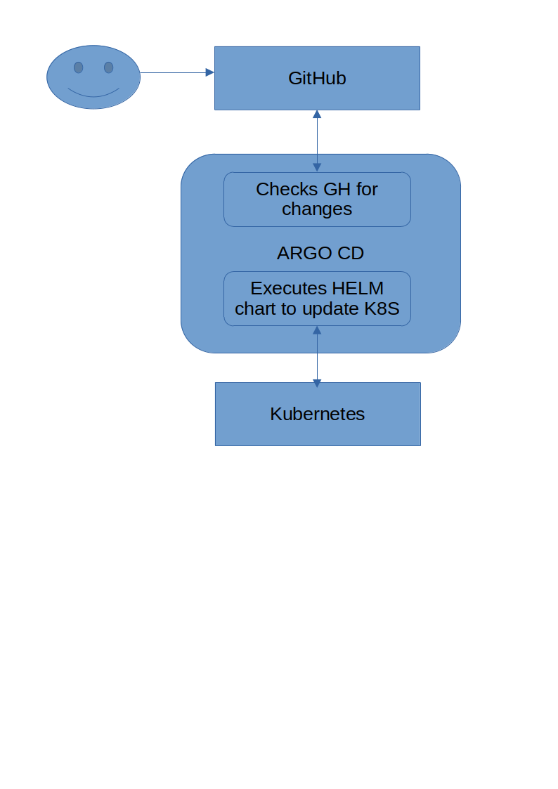

# kbot

Project to create Telegram bot (using Go) and test CI/CD pipeline.

Bot can be found here:
https://t.me/k8s_devops_course_bot

Available commands in Telegram are:
- /start 
- /start hello

## Deploy locally

Bot can be started locally. Build binary using below command:

`make build`

Before start, TELE_TOKEN env variable needs to be set.

`Hint: use 'read -s TELE_TOKEN' and then 'export TELE_TOKEN' to define variable in a secure way.`

Use `./kbot start` to launch bot.

## Deploy in Docker

Bot can be started in Docker. Build container image using below commands:

`make image` or `make <OS> <ARCHITECTURE>` (Linux and amd64 built by default)

You can set REGISTRY environment variable to define desired repository. By default, it's set to my Docker Hub.

To launch, set TELE_TOKEN and pass it to docker using below format:

`docker run -it -e TELE_TOKEN <IMAGE>`

## Deploy in Kubernetes

Deploy can be done using ArgoCD. Refer to [this instruction](https://github.com/bu4man/AsciiArtify/blob/main/doc/POC.md). 

Overall deploy looks like:

## Security checks of git code

Security checks are performed when git commit command is executed using .git/pre-commit bash script and gitleaks utility
In order to use this feature please do following

1. copy `pre-commit` file from root directory into .git/hooks
2. enable security checks by executing `git config --add hooks.pre-commit.enable true`
3. add some secrets into code, add file into git and try to commit
